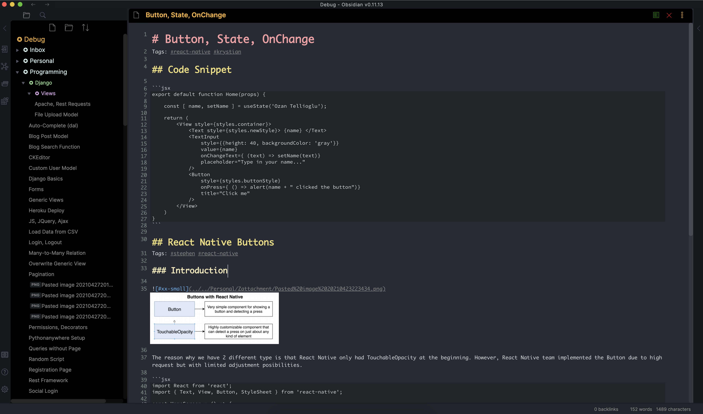
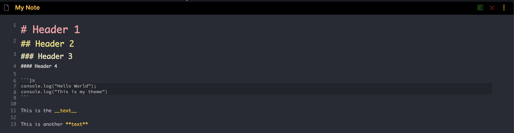
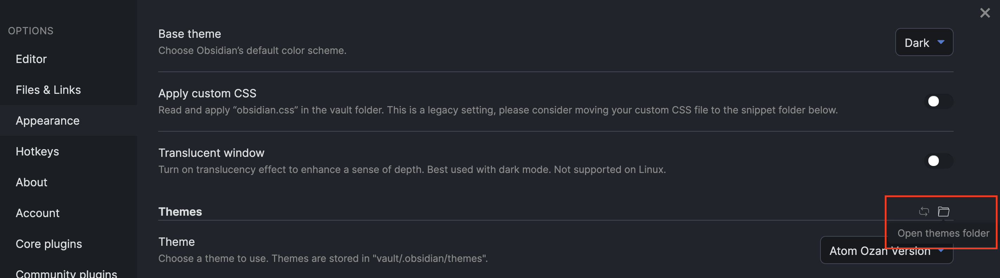

# Ozan Atom Dark Theme for Obsidian

## Introduction

Hello everyone,

I created a theme for my usage, however, please feel free to use in case you like the style and colors selected. It should exactly same if you select Dark Theme from your Appearance settings.

- I tried to change the navigation bar so that folders and files looks different than each other. Also the color of each level of folder is different. I only made for 4 levels. In case you need more, you can include more within the `css` file as per your needs.

- For the code snippets, I kept highlighting only on the part of the codes. It looks more clear for me.

- I changed the size, color of headers. Also bold texts are going to be differentiated. 

- I changed the color of some bars in the window and decreased the size of text.

- The color of buttons for files (close, preview, options) are also changed.

## Look

It looks finally as below:

## How to use

To be able to use, you need to go to:

*Settings > Appearance > Themes > Open Themes Folder*

and paste the `.css` file you can find within the repo:

## Support

